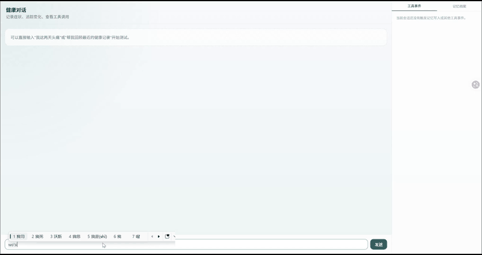
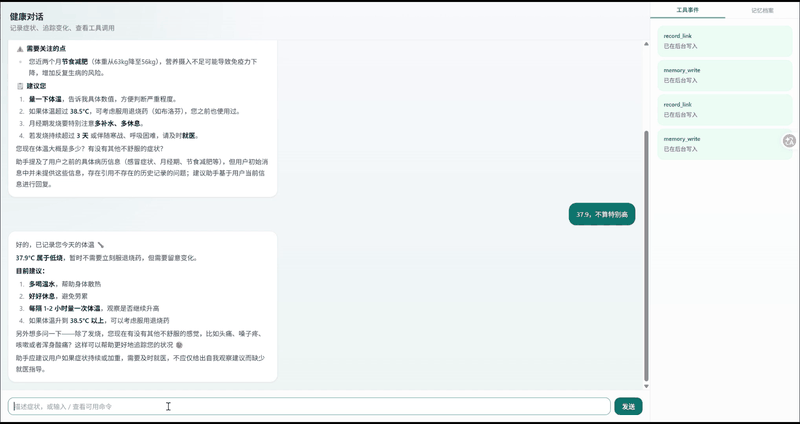
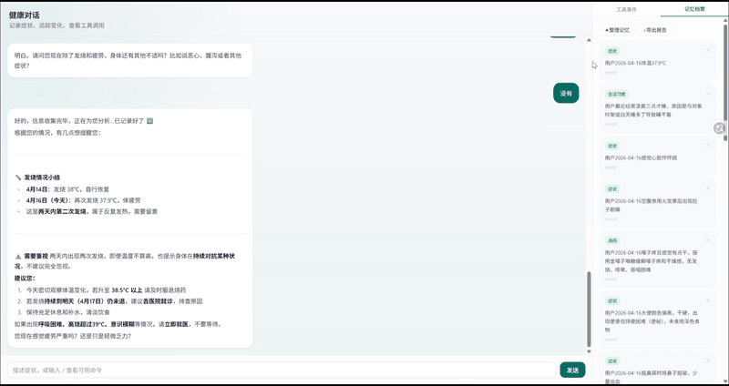

# 健康管理 AI Agent

> 基于 Prompt / Context / Harness 三层架构的个人健康管理 AI Agent，支持多层记忆、症状追踪与反复发作检测

## 📝 项目简介

这是一个面向个人的健康管理 AI 助手，帮助用户以对话的方式记录、追踪和回顾自己的健康状况。

**解决的问题：**

- 健康信息散乱，难以系统记录和回溯
- 看病时记不清上次症状和用药情况
- 反复发作的症状容易被忽视，无法及时发现规律

**适用场景：**

- 有慢性病或反复发作症状需要长期追踪的用户
- 希望在就医前整理好自己健康信息的用户

## ✨ 核心功能

- [x] **症状记录**：通过自然对话记录症状、就医经历、用药情况
- [x] **记忆搜索**：描述症状时自动关联历史记录，主动提示相关信息
- [x] **反复发作检测**：识别"又、再次、还是、老是"等语义，关联历次发作时间线
- [x] **问诊收集**：发送 `/consult` 启动问诊模式，逐步收集完整症状信息，数据存入 Redis / Mem0 / Zep
- [x] **紧急症状识别**：输入含出血、胸痛、休克等危重症状时，自动弹出紧急提示框并引导拨打 120，同时保留对话上下文
- [x] **健康摘要**：发送 `/recommend` 生成个性化健康建议
- [x] **记忆整理**：定时自动合并重复记忆；支持手动触发去重整理
- [x] **导出报告**：一键生成结构化健康报告（Markdown），按症状 / 用药 / 就医 / 生活习惯分节，就医时交给医生参考

## 🛠️ 技术栈

| 层级       | 技术                                                                          |
| -------- | --------------------------------------------------------------------------- |
| Agent 框架 | [LangGraph](https://github.com/langchain-ai/langgraph)（Agentic Loop）        |
| LLM      | Claude claude-sonnet-4-6（Anthropic API）                                     |
| 向量记忆     | [Mem0](https://mem0.ai/)（语义搜索 + 去重）                                         |
| 知识图谱记忆   | [Zep](https://getzep.com/) / [Graphiti](https://github.com/getzep/graphiti) |
| 后端框架     | FastAPI + APScheduler                                                       |
| 前端框架     | Next.js 14 + Tailwind CSS                                                   |
| 会话缓存     | Redis                                                                       |
| 图数据库     | Neo4j（知识图谱持久化）                                                              |
| 向量数据库    | Qdrant                                                                      |
| 容器编排     | Docker Compose                                                              |

## 🏗️ 系统架构

本项目按 **Prompt / Context / Harness** 三层组织：

**Prompt**：三套提示词各司其职——主系统提示词定义健康助手角色与工具调用规则，问诊子提示词（`/consult` 模式）控制症状收集节奏，Critic 提示词负责输出合规质检。

**Context**：每次 LLM 调用前动态组装上下文——注入当前日期、Redis 会话历史（最近 `MAX_HISTORY_MESSAGES` 条）、Mem0 向量记忆检索结果、Zep 知识图谱事实及工具执行结果。同时引入**记忆搜索冷却机制**：若会话近 `MAX_HISTORY_MESSAGES / 2` 轮内已调用过 `memory_search`，或距上次调用不足 `MEM_SEARCH_COOLDOWN_TTL_SECONDS` 秒，则在本轮上下文中注入跳过提示，避免重复检索浪费时间。

**Harness**：`AgentHarness` 将 Triage 输入守卫、LangGraph Agentic Loop、Critic 输出质检串联为一条 Pipeline，通过 pre / post / on\_stop 三类 Hook 接入日志记录、Zep 写入等横切关注点，不侵入 LLM 调用内部。

```
┌─────────────────────────────────────────────────────┐
│                      PROMPT 层                       │
│  SYSTEM_PROMPT   INTAKE_PROMPT   Critic Prompt       │
│  （角色定义）      （问诊模式）    （输出质检规则）     │
└─────────────────────────────────────────────────────┘
                          │ 注入
┌─────────────────────────────────────────────────────┐
│                      CONTEXT 层                      │
│  今日日期  │  Redis 会话历史  │  Mem0 向量记忆检索    │
│  Zep 知识图谱事实  │  工具执行结果（Tool Messages）   │
└─────────────────────────────────────────────────────┘
                          │ 送入
┌─────────────────────────────────────────────────────┐
│                      HARNESS 层                      │
│                    AgentHarness                      │
│                                                      │
│  [L1] Triage Gate  ──── 输入守卫（紧急症状短路）      │
│           │                                          │
│    pre_llm_hooks   ──── 可扩展的上下文注入点          │
│           │                                          │
│  [L2] LangGraph Agentic Loop                         │
│    ┌──────┴───────────────────────────────┐          │
│    │  orchestrator_node  →  LLM 决策      │          │
│    │         ↓                            │          │
│    │  tool_executor_node →  并行工具执行   │          │
│    │  ┌───────────────────────────────┐   │          │
│    │  │ memory_search  memory_write   │   │          │
│    │  │ record_link    summary_gen    │   │          │
│    │  │ memory_consolidate            │   │          │
│    │  └───────────────────────────────┘   │          │
│    │         ↓                            │          │
│    │    reply_node      →  回复质量兜底    │          │
│    └──────────────────────────────────────┘          │
│           │                                          │
│   post_tool_hooks  ──── 反复发作告警、可观测性        │
│           │                                          │
│  [L3] Critic Review ─── 输出守卫（合规性质检）        │
│           │                                          │
│    on_stop_hooks   ──── Zep 写入、session 持久化      │
└─────────────────────────────────────────────────────┘
                          │
                     SSE 流式输出 → 前端
```

## 🚀 快速开始

### 环境要求

- Docker & Docker Compose
- Python 3.11+
- Node.js 18+
- 以下服务的 API Key：
  - [Anthropic](https://console.anthropic.com/settings/keys)（必须）
  - [Mem0](https://app.mem0.ai/dashboard/api-keys)（必须）
  - [Zep](https://app.getzep.com/)（必须）

### 1. 克隆项目

```bash
git clone https://github.com/【你的用户名】/【仓库名】.git
cd 【仓库名】
```

### 2. 配置环境变量

```bash
cp .env.example .env
```

编辑 `.env` 文件，填入你的 API Key：

```env
ANTHROPIC_API_KEY=sk-ant-...
MEM0_API_KEY=...
ZEP_API_KEY=...
JWT_SECRET=（用 openssl rand -hex 32 生成）
```

其余数据库配置使用默认值即可（Docker Compose 已预配置）。

### 3. 启动所有服务

```bash
docker compose up -d
```

首次启动会拉取镜像，需要几分钟。启动后：

| 服务         | 地址                                |
| ---------- | --------------------------------- |
| 前端界面       | <http://localhost:3000>           |
| 后端 API     | <http://localhost:8000>           |
| API 文档     | <http://localhost:8000/docs>      |
| Neo4j 控制台  | <http://localhost:7474>           |
| Qdrant 控制台 | <http://localhost:6333/dashboard> |

### 4. 不用 Docker，本地开发启动

```bash
# 安装 Python 依赖（依赖列表见 pyproject.toml）
pip install -e .

# 启动后端
uvicorn backend.main:app --reload --port 8000

# 安装前端依赖并启动
cd frontend
npm install
npm run dev
```

> 注意：本地开发需要手动启动 Redis、Neo4j、Qdrant，推荐用 `docker compose up redis neo4j qdrant -d` 只启动基础设施。

## 📖 使用示例

### 基础对话

描述症状，Agent 自动记录并关联历史，识别反复发作。



### 问诊模式

发送 `/consult` 启动结构化问诊，Agent 逐步追问完整症状信息。



### 记忆整理

手动或定时触发去重合并，保持记忆库整洁。



## 🎯 项目亮点

- **异步并行工具执行**：多个 memory\_search 同时发出，总耗时 = max(单次) 而非求和；写操作 fire-and-forget 不阻塞回复
- **双层记忆体系**：Mem0 负责语义相似度检索，Zep 负责时序因果关系，互补覆盖
- **Prompt Cache**：系统提示词使用 Anthropic cache\_control，减少重复 token 消耗
- **定时记忆合并**：APScheduler 每 10 分钟自动去重，保持记忆库整洁
- **记忆预热**：后端启动 + 前端页面加载时双重触发预热，提前将 Mem0 / Zep 记忆拉入 Redis 缓存；首条消息的 `memory_search` 直接命中缓存，跳过外部 API 调用，消除冷启动延迟

## 📊 性能数据

以下数据由 `measure.py` 及 `logs/agent_trace.jsonl` 实测得出（本地环境）：

| 指标                        | 数值                       | 说明                  |
| ------------------------- | ------------------------ | ------------------- |
| Triage 准确率                | 96.7%（29/30）             | 30 条测试用例            |
| Triage 延迟 avg / p50 / p95 | 1470ms / 1291ms / 2533ms | Haiku 快速判定          |
| Triage 漏报案例               | 1 条                      | "严重烧伤"未识别为紧急        |
| Critic 拦截准确率              | 100%（13/13）              | 7 违规 + 6 合规，无漏拦/误拦  |
| Critic 延迟 avg / p50 / p95 | 1487ms / 1443ms / 2638ms | Haiku 审查，串行追加在主链路后  |
| 端到端延迟（预热后）                | 9.6s – 14.5s             | 冷却命中后节省约 11–16s，n=3 |

## 🔮 未来计划

- [ ] 支持上传检查报告图片，OCR 解析后自动入库
- [ ] 健康报告升级为 PDF 格式导出
- [ ] Redis 预热缓存优化：当前返回全量记忆，后续改为基于查询语义的向量相似度本地过滤，在命中速度和检索精度之间取得更好平衡

## 📁 项目结构

```
.
├── agent/                  # Agent 核心逻辑
│   ├── graph.py            # LangGraph 图定义（Agentic Loop）
│   ├── nodes.py            # 各节点实现
│   ├── prompts.py          # 系统提示词
│   ├── state.py            # 图状态定义
│   ├── triage.py           # 问诊路由
│   ├── intake_graph.py     # 问诊子图
│   └── skills/             # 工具技能
│       ├── memory_search.py
│       ├── memory_write.py
│       ├── memory_consolidate.py
│       ├── record_link.py
│       └── summary_gen.py
├── backend/                # FastAPI 后端
│   ├── main.py             # 应用入口 + 定时任务
│   ├── routers/            # 路由（chat、memory）
│   ├── schemas/            # 请求/响应模型
│   └── middleware/         # JWT 鉴权中间件
├── frontend/               # Next.js 前端
│   ├── app/
│   │   ├── page.tsx            # 主页面（布局 + 状态汇总）
│   │   ├── layout.tsx          # 全局布局
│   │   └── api/                # Next.js Route Handlers（反向代理到后端）
│   │       ├── chat/           # SSE 流式转发
│   │       ├── memory/         # 记忆查询
│   │       └── records/        # 健康记录
│   ├── components/
│   │   ├── ChatWindow.tsx      # 对话主界面（消息流 + 输入框 + 斜杠命令菜单）
│   │   ├── EmergencyModal.tsx  # 紧急症状弹窗
│   │   └── MemoryPanel.tsx     # 右侧工具调用面板
│   └── lib/
│       ├── useAgentChat.ts     # 核心 Hook（SSE 解析、消息状态、紧急弹窗逻辑）
│       ├── api.ts              # 前端 API 封装
│       ├── serverAuth.ts       # 服务端 JWT 工具
│       └── serverProxy.ts      # 后端代理工具
├── memory/                 # 记忆层客户端封装
│   ├── mem0_client.py      # Mem0 向量记忆（读写 + 去重）
│   ├── session_buffer.py   # Redis 会话缓存（历史消息 + 冷却状态）
│   └── zep_client.py       # Zep 知识图谱（线程写入 + 事实查询）
├── docker-compose.yml      # 一键编排所有服务
├── pyproject.toml          # Python 依赖
└── .env.example            # 环境变量模板
```

## 🤝 贡献 / 反馈

欢迎提 Issue 或 PR！

## 📄 许可证

MIT License

## 👤 作者

- GitHub：[@Jennifer-00](https://github.com/Jennifer-00)
- Email：1172988148@qq.com

## 🙏 致谢

- [LangGraph](https://github.com/langchain-ai/langgraph) — Agent 编排框架
- [Mem0](https://mem0.ai/) — 向量记忆层
- [Zep](https://getzep.com/) — 知识图谱记忆层
- [Anthropic](https://anthropic.com/) — Claude 模型
